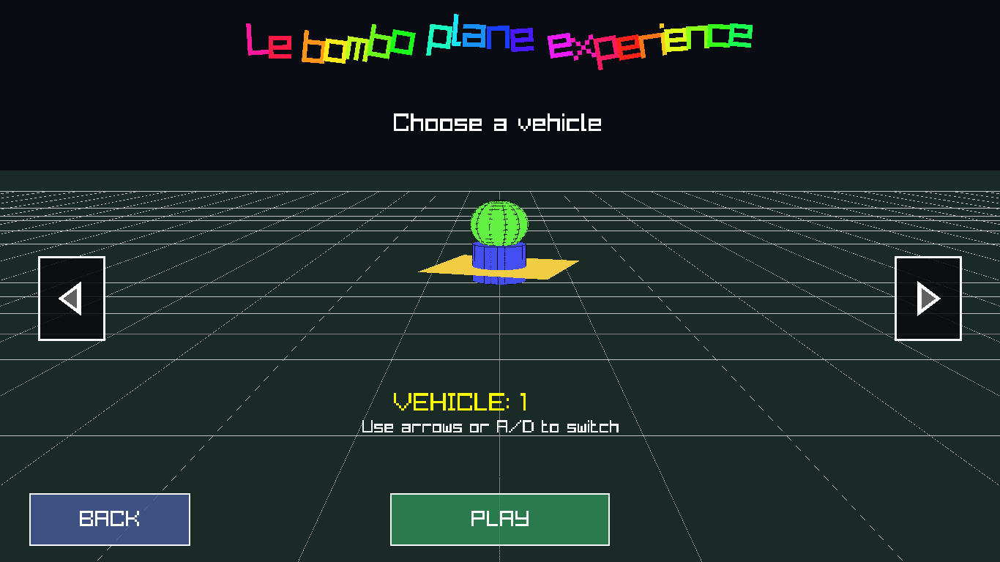

# Le Bombo Flying Experience

Originally this project started as a GPU benchmark, then evolved into a chaotic 3D arcade game inspired by Terry Davis' Flight Simulator.

You fly over a procedural city, pick different vehicles, and maximize destruction with machine-gun fire, bombs, laser attacks, and nuke events.

## Clone The Repository

```bash
git clone https://github.com/Edgar-GIT/Le-Bombo-Flying-Experience.git
cd Le-Bombo-Flying-Experience
```

## Screenshots

### Main Menu


### Vehicle Select


### Gameplay


### Game Engine - Main Editor


### Game Engine - Scene + Inspector


### Game Engine - 2D Workflow


### Game Engine - Preview Mode


### Custom Vehicle In Main Game


## Tech Stack

- Languages: C (C99), C++, Zig
- Rendering/Audio: Raylib (`raylib`, `raymath`, `rlgl`)
- Backend via Raylib: OpenGL
- C: main game runtime, gameplay systems, effects, menus
- C++: Game Engine editor UI/workflow/modules
- Zig: optimized builders and runtime optimization bridge

## Main Game Features

- 3D flight gameplay over a procedural city
- Vehicles: Helicopter, Jet F-16, Airplane, UFO, Drone, Hawk, Custom Vehicle
- Attack systems: machine gun, bombs, laser-style shots, nuke logic
- Score event system with media triggers
- Combo/multiplier systems and UI overlays
- Dynamic destruction and large effect pipelines
- Loads latest exported custom vehicle (`.vehicle`) from the Game Engine builds folder

## Tools Folder

`main/tools/` contains helper programs and platform-specific binaries:

- `main/tools/src/build_tool.c`: builds game and previewer
- `main/tools/src/vehicle_previewer.c`: lightweight vehicle preview app
- `main/tools/linux`, `main/tools/macos`, `main/tools/windows`: prebuilt platform helpers

Build tool options:

- `--all`
- `--game`
- `--preview`
- `--run-preview`
- `--no-zig`
- `--help`

## Build And Run (Zig - Recommended)

Use these commands from the repository root on Linux, macOS, or Windows:

```bash
zig build              # builds LBFE + vehicle_previewer
zig build run          # builds and runs LBFE
zig build preview      # builds only vehicle_previewer
zig build run-preview  # builds and runs vehicle_previewer
zig build engine       # builds GameEngine editor
zig build run-engine   # builds and runs GameEngine editor
```

### Windows Notes

- Run commands from the project root in the same terminal where `zig` and `raylib` are available.
- If you use MSYS2 UCRT64, install dependencies there (example):

```bash
pacman -S --needed mingw-w64-ucrt-x86_64-raylib zig
```

- Then run:

```bash
zig build run
zig build run-engine
```

### Legacy Zig Script Path

```bash
zig run main/GameEngine/src/zig/main.zig -- --all
zig run main/GameEngine/src/zig/engine_build.zig
```

If you are already inside `main/GameEngine/src/zig`, use:

```bash
zig run main.zig -- --all
zig run engine_build.zig
```

### C Manual Path (Linux)

```bash
gcc -std=c99 -O2 \
    main/src/main.c main/src/game.c main/src/ui.c main/src/obj.c \
    main/src/atacks.c main/src/screens.c main/src/config.c main/src/custom_vehicle.c \
    -o main/LBFE \
    -lraylib -lGL -lm -lpthread -ldl -lrt -lX11
```

## Game Engine

The editor lives in `main/GameEngine/` and is focused on creating fully playable custom vehicles for the main game.

### Game Engine Structure

- `main/GameEngine/src`: source code
- `main/GameEngine/projects`: project workspaces (`scene.json`, `autosave.json`)
- `main/GameEngine/pieces`: reusable piece templates (`.piece`)
- `main/GameEngine/builds`: final exported vehicles (`.vehicle`)
- `main/GameEngine/cache`: temporary cache/recovery data

### Implemented Features (Current)

- Dedicated editor window with dark UI
- Top bar actions: `New`, `Open`, `Save`, `Export`, `Import`, `Settings`
- Workspace tabs:
  - project/piece tabs
  - close tab (`x`)
  - right click context (`Rename`, `Duplicate`, `Close`)
  - inline tab rename
  - create new tab/new piece tab
- Left tool rail:
  - `SCN` scene manager
  - `BLK` block palette
  - `CLR` color editor
  - `PCS` piece workflow
  - `LSR` lasers/shotpoints
- Toggleable side panels (left and right)
- 2D / 3D viewport modes
- View tools: move/rotate/scale/select/undo/redo/preview/prev blasts/isolate
- Mirror tool in toolbar with axis switch (`X`, `Y`, `Z`)
- Adaptive toolbar sizing so labels fit better
- Rectangle multi-select
- Selection drag-copy to other tabs
- Clipboard actions:
  - `Ctrl+C` copy selection
  - `Ctrl+V` paste selection
  - `Ctrl+X` cut selection
  - `Ctrl+D` duplicate selection
- Inspector editing:
  - rename
  - visible/hidden
  - anchored/free
  - transform values
  - hierarchy parent
  - layer assignment
- Layer system:
  - add layer
  - active layer
  - show/hide per layer
  - assign selected object to active layer
- Scene list with hierarchy indentation lines
- Color panel with hue/saturation/value workflow
- Block palette filtering: `All`, `2D`, `3D`
- Drag/drop primitive creation into viewport
- Piece workflow:
  - create piece from selection
  - save active piece tab
  - reload piece library
  - open piece in tab
  - spawn piece into scene
- Vehicle forward direction setup:
  - yaw offset
  - presets (`Front`, `Right`, `Back`, `Left`)
- Shotpoint system:
  - add/delete shotpoints
  - bind to selected object
  - define placement in isolated placement view
  - placement with XYZ gizmo drag
  - shotpoint color/size/enable controls
  - preview single shotpoint
  - preview all blasts
- Preview windows:
  - dedicated scene preview
  - blast preview modes
  - navigation and look controls
- Delete confirmation popup (single and multi-delete)
- Status/console panel with timestamped logs
- Settings panel for camera/gizmo/preview sensitivities
- Persistence:
  - create/open/save projects
  - autosave and recovery hooks
  - piece and workspace synchronization
- Export validation:
  - blocks required
  - no empty/duplicate block names
  - at least one active valid shotpoint
- `.vehicle` import back into editor (`Import` button)
- Runtime integration: exported `.vehicle` appears in main game vehicle flow

## Basic Mini Tutorial (Game Engine)

1. Open the engine.
2. Click `New` and create/open a project.
3. In `BLK`, add primitives (click or drag into viewport).
4. Use `Move`, `Rotate`, `Scale` to shape your vehicle.
5. Use `SCN` for layers/hierarchy/visibility.
6. Use `CLR` to set colors.
7. In `LSR`, create shotpoints, bind to parts, and set placement.
8. Click `Preview` / `Prev Blasts` to test the model and firing points.
9. In `PCS`, create reusable `.piece` parts if needed.
10. Set front direction in `PCS` using yaw or the preset buttons.
11. Click `Save`.
12. Click `Export` to generate `.vehicle` in `main/GameEngine/builds`.
13. Run the main game and select the custom vehicle.

## Editor Controls (Quick Reference)

- `W` / `E` / `R`: move/rotate/scale mode
- `Ctrl+Z` / `Ctrl+Y`: undo/redo
- `Ctrl+C` / `Ctrl+V`: copy/paste selection
- `Ctrl+X` / `Ctrl+D`: cut/duplicate selection
- `Delete` / `Backspace`: request delete selected
- Mouse wheel: zoom
- `RMB`: look/orbit
- `MMB` or `Shift+RMB`: pan
- Preview window:
  - `WASD` move
  - arrows look
  - `Shift` speed up
  - `Esc` close

## Build And Run (Game Engine - Manual)

Recommended:

```bash
zig build run-engine
```

Linux manual compile:

```bash
g++ -std=c++17 -O3 \
    main/GameEngine/src/main/main.cpp \
    main/GameEngine/src/main/config.cpp \
    main/GameEngine/src/main/gui_manager.cpp \
    main/GameEngine/src/main/gui_workflow.cpp \
    main/GameEngine/src/main/gui_shotpoints.cpp \
    main/GameEngine/src/main/main_gui.cpp \
    main/GameEngine/src/main/vehicle_export.cpp \
    main/GameEngine/src/main/vehicle_import.cpp \
    main/GameEngine/src/main/persistence.cpp \
    main/GameEngine/src/main/persistence_io.cpp \
    main/GameEngine/src/main/persistence_picker.cpp \
    main/GameEngine/src/main/workspace_tabs.cpp \
    main/GameEngine/src/main/piece_library.cpp \
    -I main/GameEngine/src/include \
    -o main/GameEngine/src/GameEngine \
    -lraylib -lGL -lm -lpthread -ldl -lrt -lX11
```

## Custom Vehicle Runtime Pipeline

1. Build vehicle in Game Engine.
2. Export to `.vehicle`.
3. File is saved to `main/GameEngine/builds/`.
4. Start `LBFE`.
5. Game auto-loads newest `.vehicle` and exposes it as custom vehicle.

## Future Direction

- Grow Game Engine into a full creator platform
- Add stronger benchmark/stress-test modes
- Continue performance work in C/C++/Zig without reducing gameplay quality
