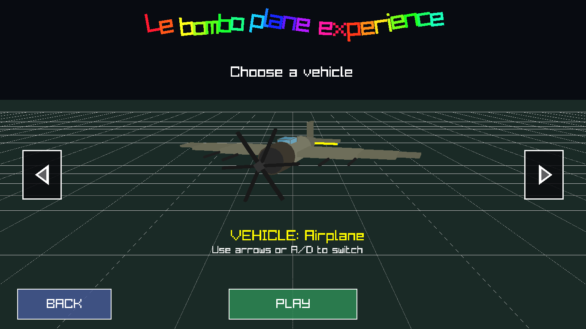
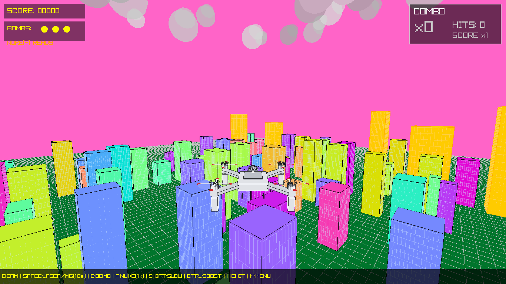
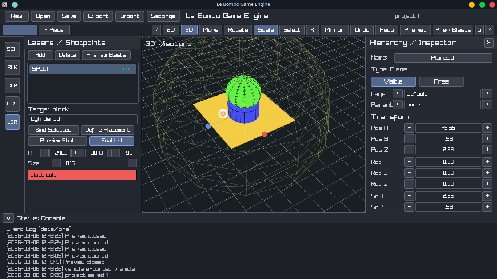
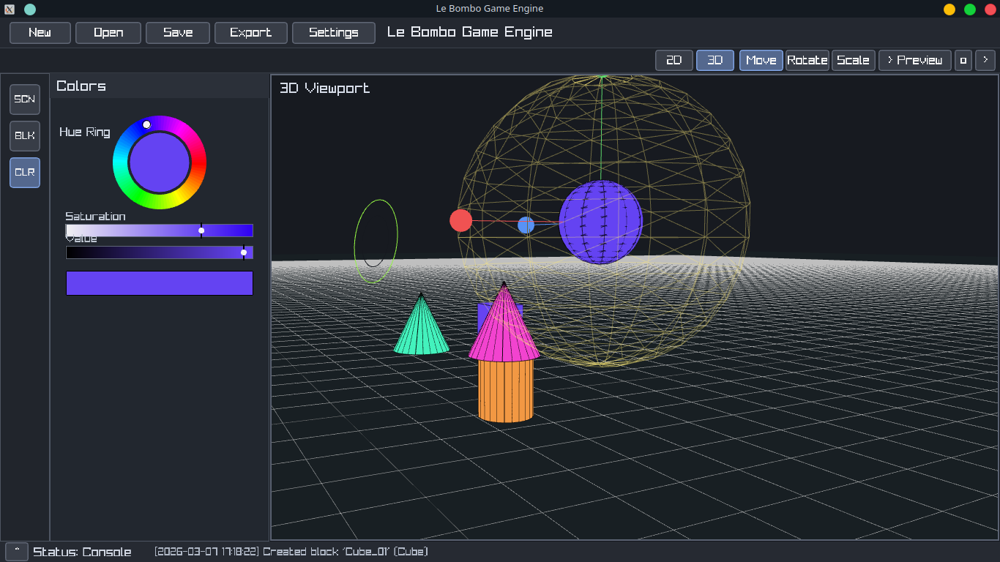
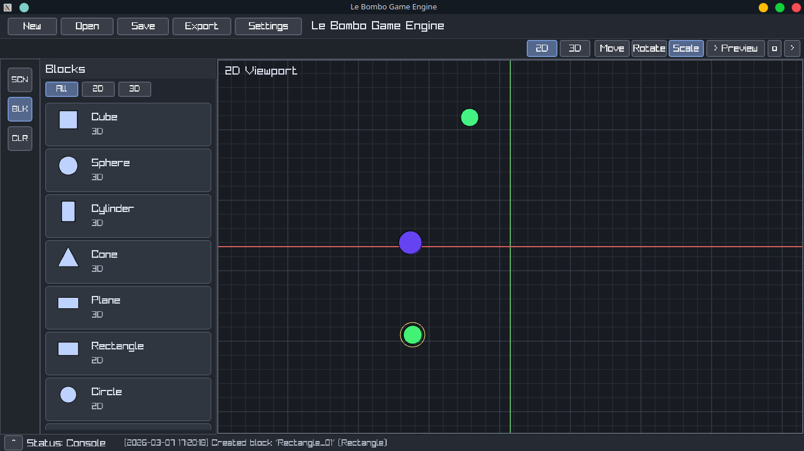
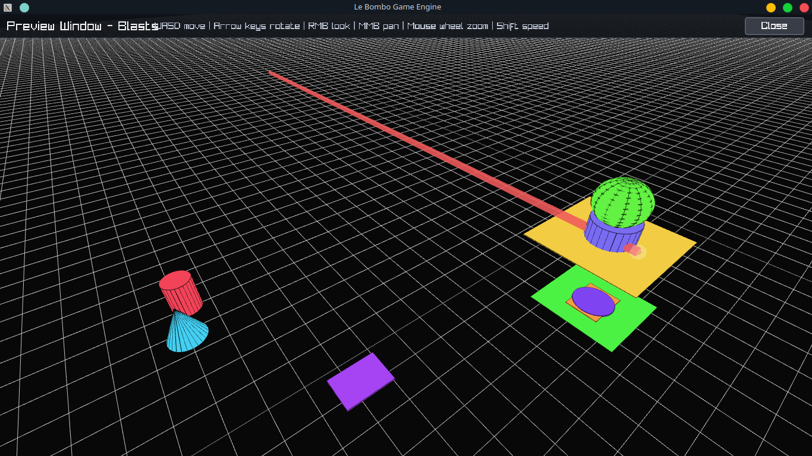

# Le Bombo Flying Experience

Originally this project started as a GPU benchmark, then evolved into a chaotic 3D arcade game inspired by Terry Davis' Flight Simulator.

You fly over a procedural city, pick different vehicles, and maximize destruction with machine-gun fire, bombs, and a nuke event.

## Screenshots

### Main Menu


### Vehicle Select


### Gameplay


### Game Engine - Main Editor


### Game Engine - Color + Inspector


### Game Engine - 2d mode and Block Workflow


### Game Engine - Preview Mode


## Tech Stack

- Languages: C (C99), Zig, C++
- C (C99): gameplay loop, rendering logic, attacks, UI, assets
- Zig: optimized build pipeline + optimization bridge/runtime helpers
- C++: Game Engine editor architecture and UI layer
- Graphics/Audio: Raylib (`raylib`, `raymath`, `rlgl`)
- Rendering backend (via Raylib): OpenGL

## Game Features

- 3D flight gameplay with multiple vehicles (Hellicopter, Alien ship, Plane, Drone, Stealth bomber, F16 Jet)
- Procedural city generation
- Combat systems: machine-gun, laser, bombs, nuke
- HUD overlays, score-based events, menu flow
- Extra helper tooling for faster workflow

## Clone The Repository

```bash
git clone https://github.com/Edgar-GIT/Le-Bombo-Flying-Experience.git
cd Le-Bombo-Flying-Experience
```

## Tools Folder

The `main/tools/` folder contains helper programs and platform separation:

- `main/tools/src/build_tool.c`: automated build system for game and/or vehicle previewer
- `main/tools/src/vehicle_previewer.c`: lightweight vehicle preview (left/right arrows + vehicle name)
- `main/tools/linux`, `main/tools/macos`, `main/tools/windows`: platform-specific build binaries

### Quick Start (Recommended)

From the project root:

```bash
# Build game and previewer (Linux example)
./main/tools/linux/build_tool --all

# Run the game
./main/LBFE
```

Build options:

- `--all` - build game + previewer
- `--game` - build game only
- `--preview` - build previewer only
- `--run-preview` - build and run previewer
- `--no-zig` - disable Zig path and use fallback C compiler path
- `--help` - show help

Generated binaries:

- `main/LBFE` (or `main/LBFE.exe` on Windows)
- `main/build/<platform>/vehicle_previewer`

## Build And Run (Game)

### Automated Build

From the project root:

```bash
./main/tools/linux/build_tool --all
./main/tools/macos/build_tool --all
.\main\tools\windows\build_tool.exe --all
```

Then run:

```bash
./main/LBFE
```

Build behavior:

- `build_tool` tries Zig first (`zig run main/GameEngine/src/zig/main.zig -- ...`)
- if Zig is unavailable/fails, it falls back to the C compiler path
- use `--no-zig` to force C-only path

### Manual Build

Assets are loaded with relative paths (`img/...` and `music/...`), so keep executable output in `main/`.

#### Zig path (recommended)

```bash
zig run main/GameEngine/src/zig/main.zig -- --all
./main/LBFE
```

#### C fallback (Linux)

```bash
gcc -std=c99 -O2 \
    main/src/main.c main/src/game.c main/src/ui.c main/src/obj.c \
    main/src/atacks.c main/src/screens.c main/src/config.c \
    -o main/LBFE \
    -lraylib -lGL -lm -lpthread -ldl -lrt -lX11

./main/LBFE
```

## Game Engine

A separate `main/GameEngine/` workspace is being built to let players create custom vehicles.

### Folder Structure

- `main/GameEngine/src` - engine/editor source code
- `main/GameEngine/projects` - editable work files (drafts/in-progress)
- `main/GameEngine/builds` - exported/shareable final builds
- `main/GameEngine/schemes` - format/version rules for validation
- `main/GameEngine/cache` - temporary preview/cache files

### Current Capabilities (Implemented)

- Dedicated editor window with dark UI
- Top toolbar (`New`, `Open`, `Save`, `Export`, `Settings`) and editor mode controls
- Left tool tabs:
  - `SCN`: scene manager
  - `BLK`: block/primitive palette (click or drag-drop to viewport)
  - `CLR`: color editing panel
- 2D/3D viewport modes
- Scene object selection + highlight
- Inspector panel (rename, visibility, anchored/free, position/rotation/scale)
- Gizmo modes: `Move`, `Rotate`, `Scale`
- Delete flow with confirmation popup (`Backspace/Delete`, `X` in scene manager, `X` in inspector)
- Live preview mode with dedicated controls
- Event console in status panel with timestamped logs (create/rename/delete/preview)
- Settings for camera and editor sensitivities

### Editor Controls (Current)

- `W`, `E`, `R`: switch gizmo mode (`Move`, `Rotate`, `Scale`)
- `Backspace` / `Delete`: request delete for selected block (with confirmation)
- `LMB` on handles: manipulate selected block
- `RMB` drag: orbit camera
- `Shift + RMB` or `MMB`: pan camera
- Mouse wheel: zoom
- `Preview` button: open preview window

#### Preview Controls

- `WASD`: move camera
- Arrow keys: rotate view
- `RMB` drag: free look
- `MMB` drag: pan
- Mouse wheel: zoom
- `Shift`: faster movement
- `Esc` or `Close`: exit preview

### How To Use The Game Engine (Current Workflow)

1. Open the editor.
2. Go to `BLK` and add primitives (click or drag into viewport).
3. Select blocks from viewport or scene manager.
4. Use `Move/Rotate/Scale` gizmo modes to shape the vehicle.
5. Use `CLR` to adjust colors.
6. Fine-tune values in the inspector.
7. Open `Preview` to test the model view and camera movement.

### Planned Features (Not Implemented Yet)

- Full project persistence (`New/Open/Save/Export`) with durable file format
- Vehicle package pipeline from editor output directly into game runtime
- Full custom vehicle behavior authoring (weapons, attack patterns, effects)
- Asset/material pipeline beyond primitive-only workflow
- Validation tooling using schemes during export/import
- Extended in-editor build sharing workflow and distribution packaging
- Optional stress-test/benchmark mode integrated with editor-generated vehicles

## Build And Run (Game Engine)

### Recommended (Zig builder)

From project root:

```bash
zig run main/GameEngine/src/zig/engine_build.zig
./main/GameEngine/src/GameEngine
```

From inside `main/GameEngine/src/zig`:

```bash
zig run engine_build.zig
../GameEngine
```

Generated binary:

- `main/GameEngine/src/GameEngine` (Linux/macOS)
- `main/GameEngine/src/GameEngine.exe` (Windows)

### Manual Compile (Linux)

```bash
g++ -std=c++17 -O3 \
    main/GameEngine/src/main/main.cpp main/GameEngine/src/main/config.cpp main/GameEngine/src/main/gui.cpp \
    -I main/GameEngine/src/include \
    -o main/GameEngine/src/GameEngine \
    -lraylib -lGL -lm -lpthread -ldl -lrt -lX11
```

## Future Direction

This project is intended to keep growing over time.

- Expand gameplay systems and vehicles
- Evolve the Game Engine into a complete creator workflow
- Keep optimization work in Zig/C++ while preserving gameplay quality
- Maintain optional benchmark/stress-test paths
